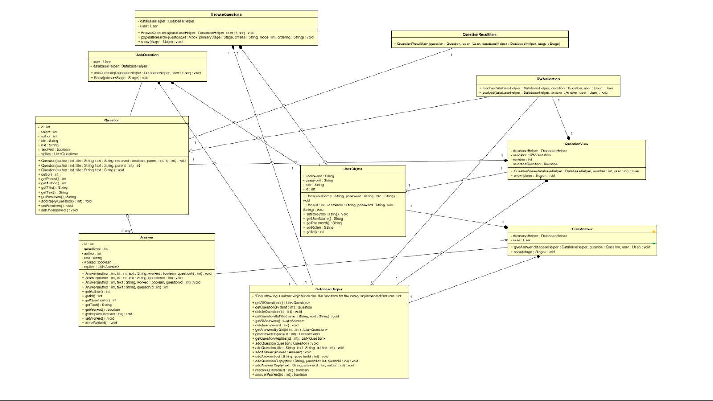

# CSE360TeamProject2

**Group:** Monday 10  
**Members:**
- Ryan Kimberley
- Cedric Claessens
- Dylan Eden
- Rudheer Reddy Chintakuntla
- Kripal Naveen Kumar Mogala
- Varshan Reddy Mallipeddi

### Screencasts:

- **Screencast testing the Team’s HW2:** [Meeting Link](https://asu.zoom.us/rec/share/YtJrAU_fok6lzJarJT5NQgQcjILZ9czPnF_jD4u1L7zlezHyzTezI2fhyX4RdV0x.g-NWLCtTE3Am6KgH ) (Passcode: E?Yg4i+g)
- **Screencasts showing the manual tests:** [Meeting Link](https://asu.zoom.us/rec/share/RA4CazqF_HqNto8zZ7UBRFwrW7ttTW_LLSNJ6_0iEgxN0AfYQ1g45hWet-sLaKOR.wKJ8J878LYYmMlQe) (Passcode: uPz?6y48)
- **Screencasts showing the satisfaction of the requirements:** [Meeting Link](https://asu.zoom.us/rec/share/gzk0YPgbtwELjXoJKPmioO-MWT7SebJHhYDQdxFkbctIg_r1DTwGGcIiPQNFzfeM.M7d_ofceNN_Az6mN) (Passcode: MG^m4YrF)

### Standup Meeting Recordings:

- **Standup Meeting 1 (2/21):** [Meeting Link](https://asu.zoom.us/rec/share/n0O6zgSET6fickomqDHX6E5CaFldWQ0aFEvUwQHDCO8dDOrKe9uJzLfjVgiQLuRN.cExqU4OCLVztMywy) (Passcode: N&.rMp3s)
- **Standup Meeting 2 (2/22):** [Meeting Link](https://asu.zoom.us/rec/share/AywRUu1jEk_e59myDy1r_zE1RwpjJXPhw1--PoAvRztnh7nbAb8-j5V-zLASI2lN.EhVxAPBEnPvmEcvV) (Passcode: 2y^y49%e)
- **Standup Meeting 3 (2/23):** [Meeting Link](https://asu.zoom.us/rec/share/vYrL-IY7f5TfaerSDyuEqR2jpmk6dz6jNvAhWHyWmfeZvVuKqWVRfNk914_UkfUK.QrAV9Zv2rJPYyL_E) (Passcode: ma@#$5$3)
- **Standup Meeting 4 (2/24):** [Meeting Link](https://asu.zoom.us/rec/share/g5oaiGi7VFWmkBRa5Qk3dU08A9ZXxpA8JTxuHyKJC-NfCU9cJmgsEsoWiBNiQ6a3.RR2fb3Iuh1_LX7PF) (Passcode: d.@C8#67)
- **Standup Meeting 5 (2/25):** [Meeting Link](https://asu.zoom.us/rec/share/eN13YfDrpa_U6jGB7OiTLljC3zZOcz-G-v1V44cQPNxtbMi2A0Fag_HoFa2tpzp7.3cfN1iSjQJ3gd5dZ) (Passcode: d1Qimr2?)
- **Standup Meeting 6 (2/26):** [Meeting Link](https://asu.zoom.us/rec/share/UANJjwTOv22xOxSf2gz_3mZVE4ZDz7QmCCPyQYcTKthZaJA50foDGLubWJwB2nNN.rMZOeonjV-pJd_AZ) (Passcode: tX@55S$E)

## Implementation Plans & Ground Rules

**We use a structured approach with agile practices:**

Task assignments:
- Each member of the team is responsible for working on their own user story.

Weekly meetings:
- We hold meetings twice a week to track our progress, discuss any issues, and ensure we can integrate our code.

Peer code reviews:
- All code MUST be reviewed by another team member before merging to the main branch.

Version control:
- All work is tracked with our own GitHub repository.

## Project Overview

Our project extends our previous work on a **secure, friendly, and fast login/signup system** by introducing a **question and answer system** where users can post and answer questions. This phase focuses on **efficient user interaction, usability, and security.**

## Shared Agreement on User Experience and Interface

### Functional Requirements

1. **User Question Management:**
   - Users can create and submit questions with a title and description.
   - Users can browse and search questions based on keywords.
   - Users can delete their own questions.

2. **Answering System:**
   - Users can provide answers to posted questions.
   - Users can delete their own answers.
   - Users can mark answers as "worked" to indicate effectiveness.

3. **User Roles Supported:**
   - Admin, Student, Instructor, Staff, and Reviewer.

4. **Admin Management Functions:**
   - View all registered users.
   - Modify user roles.
   - Delete user accounts.
   - Grant temporary passwords.

5. **Role Assignment:**
   - Users may have multiple roles.
   - Users must log out and log in to switch roles.

6. **Error Messaging:**
   - Clear, user-friendly messages for invalid actions.

### Non-Functional Requirements

1. **Usability:**
   - Intuitive interface for easy navigation and faster loading.
   
2. **Security:**
   - SQL injection protection.
   - Data consistency and frequent backups.
   
3. **Availability:**
   - The system must be accessible at all times.

4. **Compatibility:**
   - Works on major browsers and operating systems.
   
5. **Maintainability:**
   - Modular, well-documented code.

6. **Expandability:**
   - Designed for future scalability.

## Design and Implementation Plan

### Updated Classes for TP2:

- **AskQuestion:** UI for users to submit questions.
- **BrowseQuestions:** UI for viewing and filtering questions.
- **GiveAnswer:** UI for users to provide answers.
- **QuestionView:** Displays question details and associated answers.
- **RWValidation:** Ensures only authorized users can resolve questions or mark answers as "worked."
- **QuestionResultItem:** Improves question display.

### User Stories

| No. | User Story | Operation | Purpose |
|----|------------|----------|---------|
| 1  | As a student, I can ask questions. | Create | Enables students to post questions. |
| 2  | As a student, I can browse and search questions. | Read/Search | Helps avoid duplicates. |
| 3  | As a student, I can delete my own questions/answers. | Delete | Gives users control over content. |
| 4  | As a student, I can mark an answer as resolving my question. | Update | Allows resolution marking. |
| 5  | As a student, I can refine my question. | Create | Improves question clarity. |
| 6  | As a student, I can find resolved and unresolved questions. | Search | Helps users find answers efficiently. |
| 7  | As a student, I can provide feedback on questions. | Read/Create | Improves question quality. |

## Implementation Progress

### Assigned Tasks and Deadlines:

| No. | User Story | Task Description | Assigned To | Testing Date |
|----|------------|------------------|-------------|--------------|
| 1  | Ask Questions | Implement UI & backend | Ryan Kimberley | 02/21/25 |
| 2  | Browse Questions | Implement search features | Dylan Eden | 02/21/25 |
| 3  | Delete Q&A | Implement delete functionality | Kripal Mogala | 02/21/25 |
| 4  | Mark Answers | Implement answer resolution | Varshan Reddy | 02/21/25 |
| 5  | Refine Questions | Implement question updates | Rudheer Reddy | 02/24/25 |
| 6  | Search & Filter | Implement search functions | Cedric Claessens | 02/24/25 |

## Testing

### Automated Tests

- **testAddQuestion:** Ensures questions can be added.
- **testGetAllQuestions:** Verifies retrieval of all questions.
- **testUpdateQuestion:** Confirms questions can be updated.
- **testDeleteQuestion:** Checks that questions can be deleted.
- **testResolveQuestion:** Ensures users can resolve questions.
- **testAddAnswer:** Verifies answers can be added.
- **testDeleteAnswer:** Confirms answer deletion functionality.

### Manual Tests

- **Creating Questions:** Posting questions appears in the list.
- **Answering Questions:** Users can submit responses.
- **Updating Questions:** Editing updates the question list.
- **Deleting Questions/Answers:** Users can remove their own posts.
- **Searching Questions:** Filter and search work as expected.

## Team Contributions

| Member | Contribution |
|--------|-------------|
| Cedric Claessens | Browse UI redesign, modified DB functions. |
| Dylan Eden | Created base HW2 code and documentation. |
| Ryan Kimberley | Reviewed and merged pull requests. |
| Rudheer Reddy Chintakuntla | Implemented reply function for questions. |
| Varshan Reddy Mallipeddi | Created user stories and JUnit tests. |
| Kripal Naveen Kumar Mogala | Developed delete functionality. |

## Team Norms

1. Adhere to deadlines with structured planning.
2. Ensure proper version control to avoid merge conflicts.
3. Weekly meetings with clear agendas.
4. Peer code reviews before merging.
5. Maintain well-documented code for maintainability.
6. Inform the team early if unable to complete a task.
7. Follow consistent naming conventions in version control.

---

 ## Included Files

See attached diagram for file level interactions and dependencies.  Solid arrows denote user path between UI files and dashed arrows denote dependencies for a file to funciton.

## Class Dependcy Diagram

This diagram shows the functions and classes implemented for TP 2 (ignoring the TP 1 carryovers unless explicitly needed).  It uses standard UML syntax.

